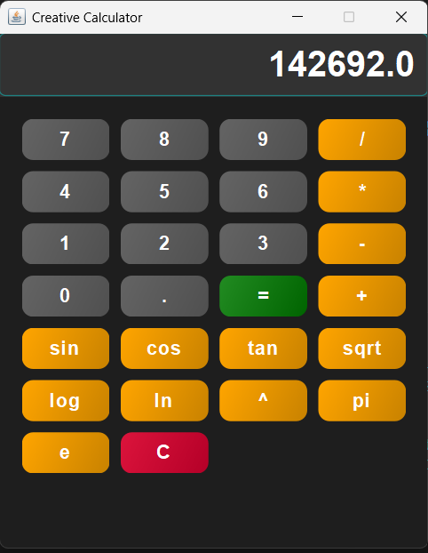

# Creative Calculator

A modern, feature-rich calculator application built with Java Swing, featuring a sleek dark theme, custom UI components, and extensive mathematical functions.

## Features

### Basic Arithmetic Operations
- Addition (+)
- Subtraction (-)
- Multiplication (*)
- Division (/)
- Exponentiation (^)

### Trigonometric Functions
- Sine (sin)
- Cosine (cos)
- Tangent (tan)

### Advanced Mathematical Functions
- Square Root (sqrt)
- Logarithm (log)
- Natural Logarithm (ln)
- Pi (π)
- Euler's Number (e)

### Planned Features
- Factorial (!)
- Inverse Trigonometric Functions (asin, acos, atan)
- Hyperbolic Functions (sinh, cosh, tanh)
- Exponential Function (exp)
- Absolute Value (abs)
- Percentage (%)
- Square (x²)
- Cube (x³)
- Reciprocal (1/x)
- Modulo (mod)

## UI Features
- Custom rounded buttons with gradient effects and animations
- Glow effect on the display field
- Placeholder text for operators
- Dark theme with modern styling
- Responsive button interactions

## Installation and Running

1. Ensure you have Java installed on your system.
2. Compile the Java file:
   ```
   javac CalculatorApp/calculator.java
   ```
3. Run the application:
   ```
   java CalculatorApp.calculator
   ```

## Usage

- Click number buttons to input digits.
- Use operator buttons for calculations.
- Press "=" to compute the result.
- Use "C" to clear the display.
- Trigonometric and other functions operate on the current display value.

## Screenshot



## Project Structure

- `CalculatorApp/calculator.java`: Main application file containing the calculator logic and UI.
- `TODO.md`: List of completed and planned features.
- `README.md`: This file.

## Contributing

Feel free to contribute by implementing the planned features or improving the UI/UX.

## License

This project is open-source. Feel free to use and modify as needed.
